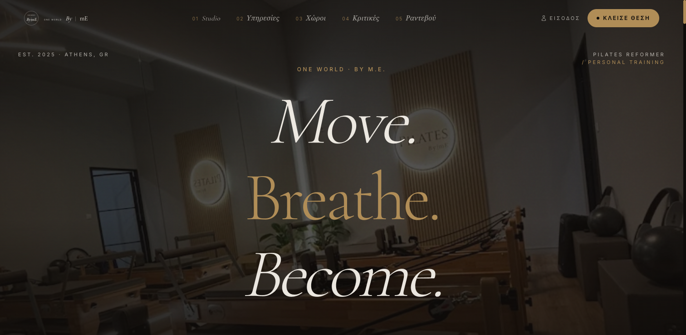
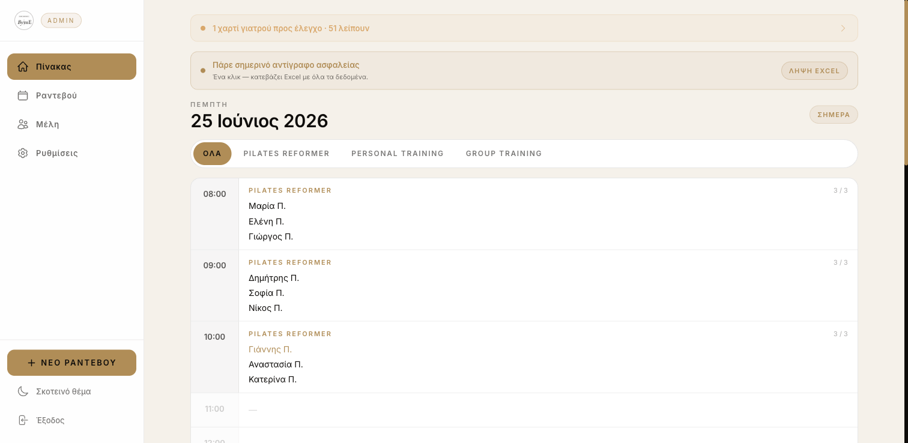

# One World ByME — studio site & booking platform

A production booking platform for a Greek pilates & personal-training studio: a
dark editorial landing page on the front, and behind it a full operations back
office — bookings, memberships, session credits, medical certificates, renewals
and reporting.

Built end to end (design, frontend, database, auth model, deployment) with
React, Supabase and Tailwind.

**→ Live: [byme-six.vercel.app](https://byme-six.vercel.app)**



---

## What it does

**Public site** — landing page with the studio's story, services, spaces,
reviews and location, plus the booking flow.

**Booking flow**
- Three services with separate per-slot capacities (Pilates Reformer 3,
  Personal Training 2, Group Training 5).
- Group Training runs a different workout type per day and time (Full Body /
  Lower / Upper / HIIT); Pilates runs its own weekday schedule. Both are
  configured from the admin panel, not hard-coded into the calendar.
- Rolling 14-day booking window.
- When a slot is full, the booking falls back to a **standby list** — a
  cancellation automatically promotes the next person waiting.
- Members cancel their own bookings from the portal; a standalone
  `/cancel/:id` page handles single-booking cancellation by link.

**Member portal** (`/me`)
- Members log in with a personal code and see their subscription, remaining
  session credits, booking history and upcoming sessions.
- Web-push reminders for upcoming bookings, sent from a scheduled Supabase
  Edge Function.

**Admin dashboard** (`/admin`)
- Bookings as a calendar or a filterable list (pending / completed / standby /
  cancelled), with a detail view per booking.
- Member records: subscriptions, session credits (+1 / −1 adjustments),
  history, renewals with discounts.
- Medical-certificate tracking with a pending → approved review flow.
- Configurable weekly schedules, capacities and studio settings.
- Excel and CSV export, plus database backups.



More screens in [`docs/screenshots/`](docs/screenshots/).

---

## Tech

| | |
|---|---|
| Frontend | React 18, React Router 7, Vite 5 |
| Styling | Tailwind CSS 3, Framer Motion |
| Backend | Supabase (Postgres, Row Level Security, Edge Functions) |
| Notifications | Web Push (VAPID) via a Supabase Edge Function |
| Export | SheetJS (`xlsx`) |
| Hosting | Vercel |

---

## Things worth pointing at

**Overbooking is guarded in the database, not just the UI.** The client already
routes full slots to standby, but two people can still confirm the same last
slot in the same instant — a race the client cannot see. A Postgres trigger
(`supabase/schema/supabase_overbooking_guard.sql`) rejects a confirmed booking
that would exceed the slot's capacity, so the invariant holds no matter what
the client does.

**Row Level Security instead of a trusted client.** Member self-service and
standby promotion go through `SECURITY DEFINER` RPCs that bypass RLS in a
narrow, controlled way, rather than opening the `members` table to the public
anon key. See `supabase/schema/supabase_security_upgrade.sql`, which documents
the ordering the migration has to follow.

**No secrets in the bundle.** Every credential comes from environment variables
(`.env.example` documents them). The Supabase service-role key is never
referenced in client code — it exists only inside the Edge Functions'
environment.

**Schema as reviewable migrations.** Each schema change is an idempotent,
commented SQL file in `supabase/schema/`, safe to re-run.

---

## Running it locally

```bash
npm install
cp .env.example .env     # fill in your own Supabase values
npm run dev
```

Then apply the SQL in `supabase/schema/` to your Supabase project (Dashboard →
SQL Editor), in the order the file headers describe. `seed_demo_data.sql`
populates demo members and bookings so the admin panel has something to show.

```bash
npm run build     # production build
npm run preview   # serve the build locally
```

---

## Status

Deployed and in use.

Admin authentication runs on Supabase Auth, and the RLS lockdown in
`supabase_security_upgrade.sql` has been applied: `members`, `bookings`,
`subscriptions` and `medical_certificates` all reject reads from the public
anon key, and member self-service reaches them only through the
`SECURITY DEFINER` RPCs.

One piece is deliberately unfinished: **transactional email**.
`src/lib/emailjs.js` is scaffolded but not wired into the booking flow, and no
email provider is configured in production — the app sends no email today.
Member-facing notifications go out over web push instead.

---

## License

Copyright © Giannis Gero. All rights reserved.

This repository is published so the work can be read and reviewed. It is not
open source — no permission is granted to use, copy, modify or distribute the
code or the design. Get in touch if you'd like to license it.
